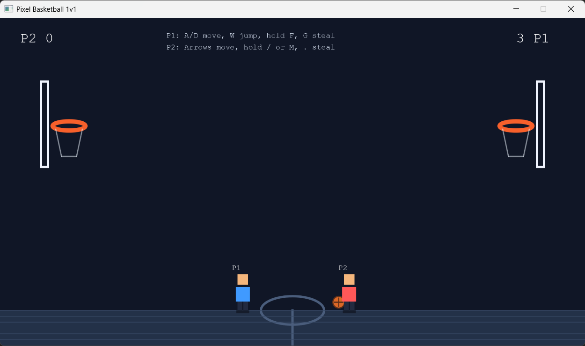

# Pixel Basketball

## Team cs课上CS
- 林愉森（Stephen Lin）
- 孙正帅（Teppo）
- 吴玮桐（Doni Wu）


## Project Description
Just a pixel basketball game, classic but still cool!

## How to Run
Make sure you are in the folder that contains pom.xml and maven has been installed on your computer successfully.

```bash
mvn package
mvn javafx:run
```
## Screenshot
java

---

© 2025-2026 Team A. All rights reserved.
This project was created as part of the AP Computer Science A class 2025-2026, AP Division, Shenghua Zizhu Academy.

