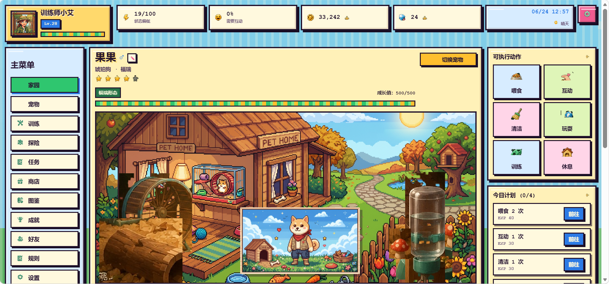

# Pet Store

## Team 暴龙福瑞战士
- 蔡佶轩（Kimi Cai）
- 邢震宇（Rain Xing）
- 徐卓睿（Louis Xu）


## Project Description
Let's have some pets...

## How to Run
Make sure you are in the folder that contains pom.xml and maven has been installed on your computer.
```bash
java Main.java
```

Then open:

http://localhost:8080
## Screenshot


---

© 2025-2026 Team A. All rights reserved.
This project was created as part of the AP Computer Science A class 2025-2026, AP Division, Shenghua Zizhu Academy.

