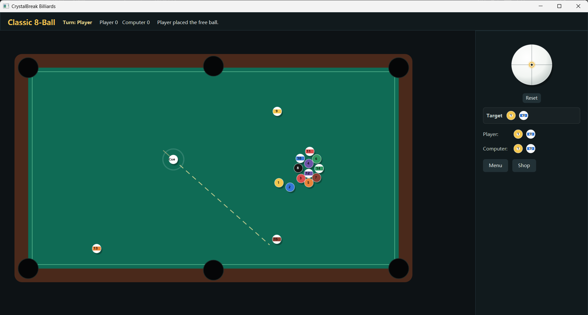

# CrystalBreak Billiards

CrystalBreak is a Java 21+ / JavaFX 2D billiards game that combines classic 8-ball pool with RPG progression, mining rewards, crystal effects, skill-shot challenges, chaos events and a boss challenge.


## Team 最严厉的父亲
- 钱麦乔（Mike Qian）
- 王泽华（Zehua Wang）
- 解华康（Lars）
- 严粒（Light Yan）
- 张方睿（Leo Zhang）


## Screenshot
java

---

## How to Run

if on Mac/Linux
```bash
sh run.sh
```

If on Windows, just execute run.bat.

Equivalent explicit Maven command:

```bash
mvn org.openjfx:javafx-maven-plugin:0.0.8:run
```

The full plugin coordinate avoids Maven prefix-resolution issues such as
`No plugin found for prefix 'javafx'`. If your Maven environment resolves
OpenJFX prefixes correctly, `mvn javafx:run` is equivalent.

Build a distributable jar/classes package:

```bash
mvn -DskipTests package
```

The current workspace has Java installed, but no `mvn` or `gradle` executable in `PATH`. Install Maven or import `pom.xml` in IntelliJ IDEA/Eclipse/VS Code to run the project.

## Project Structure

```text
CrystalBreak/
├── pom.xml
├── README.md
├── docs/
│   └── UML.md
└── src/main/
    ├── java/
    │   ├── module-info.java
    │   └── com/crystalbreak/
    │       ├── app/             # JavaFX application entry
    │       ├── ai/              # Computer player and shot planning
    │       ├── audio/           # Sound manager and sound event types
    │       ├── controller/      # MVC controller and rule resolution
    │       ├── ext/             # Future online/Steam/workshop extension ports
    │       ├── model/           # Balls, table, players, effects, RPG state
    │       ├── modes/           # Classic, Crystal, Mining, Skill, Chaos, Boss
    │       ├── persistence/     # JSON save data and settings
    │       ├── physics/         # Vector math, spin and collision engine
    │       ├── util/            # Constants and tuning
    │       └── view/            # JavaFX menu and game canvas UI
    └── resources/
        └── com/crystalbreak/
            ├── audio/           # Optional hit/collision/pocket/victory/music files
            └── css/app.css
```

## Gameplay

- Aim on the table, hold the primary mouse button, pull the cue backward to set power, then release to shoot.
- After a foul, the next click places the cue ball.
- Use the right-side cue ball strike-point control for side spin and top/back spin.
- The HUD shows turn, score, target group and compact table hints.
- The main menu supports Classic, Crystal Core, Mining Pool, Skill Shot, Chaos and Boss Challenge modes.

## Core Class Design

- `CrystalBreakApp`: JavaFX bootstrap, menu flow, settings/statistics/shop dialogs.
- `GameController`: central MVC controller; owns game loop updates, strikes, AI turns, save updates and mode callbacks.
- `GameState`: complete mutable match state: table, balls, players, active effects, current mode and timers.
- `PhysicsEngine`: table collision, ball collision, friction, spin, pockets and environmental effects.
- `RuleEngine`: 8-ball, mining and boss turn/win/foul resolution.
- `GameModeHandler`: mode extension contract. Each innovative mode is implemented as a separate handler.
- `ComputerPlayer`: AI shot selector with ghost-ball targeting, blocked-line penalties and difficulty noise.
- `SaveManager`: Jackson JSON load/save to `~/.crystalbreak/save.json`.
- `SoundManager`: optional JavaFX audio event layer. Missing audio files are safe no-ops.

## Implemented Systems

- Standard 8-ball: cue/object ball collision, legal first hit, group assignment, cue-ball foul, turn switching, score, 8-ball win/loss.
- Physics: elastic momentum exchange, rail restitution, rolling friction, spin curve, spin decay, rail spin deflection and pocket capture.
- Crystal Core Mode: central core refreshes every 30 seconds; hit it for a 15-second random effect.
- Mining Pool: object balls become ore balls. Pocketed ores award coins and XP.
- Skill Shot Mode: rotating challenges such as bank shots, two-ball pots, target group and timed pots.
- Chaos Mode: random event every 60 seconds, including gravity, tilt, speed, table shrink, moving pockets and black-hole pull.
- Boss Challenge: boss ball has HP, moves, takes repeated hits and releases special effects.
- RPG: player level, XP, coins and upgradeable cue attributes: power, accuracy, spin and stability.
- AI: Easy/Normal/Hard/Expert computer player with direct-pocket search, simple rebound fallback and collision-route prediction.
- Persistence: JSON stores level, XP, coins, high score, mode best scores, settings and cue level.

## Audio Assets

Place optional files in `src/main/resources/com/crystalbreak/audio/`:

- `hit.wav`
- `collision.wav`
- `pocket.wav`
- `victory.wav`
- `background.mp3`

The game runs without these files; the sound layer simply skips unavailable clips.

## Extension Points

- `NetworkService`: future online multiplayer transport.
- `AchievementService`: Steam or platform achievement integration.
- `WorkshopService`: creative workshop publishing/installing.
- `CustomMapProvider`: user-created table/map loading.
- `GameModeHandler`: add more modes without changing physics or UI.
