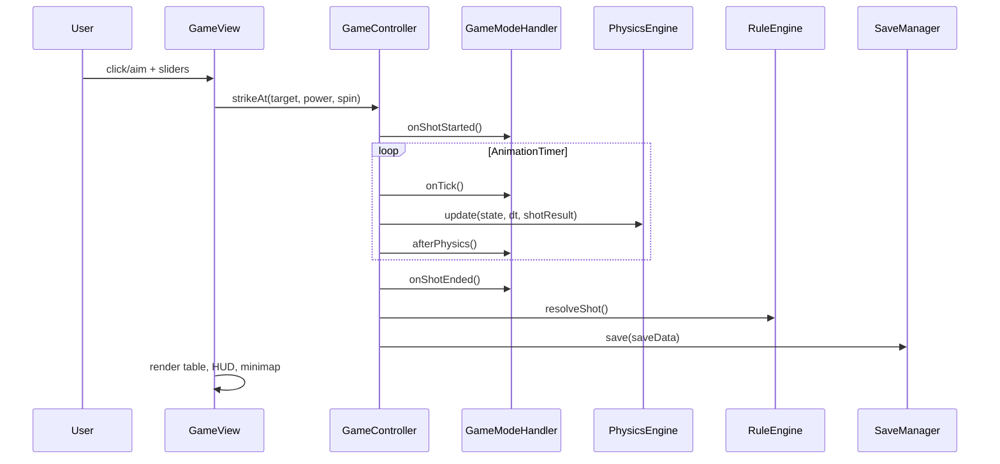

# UML Class Relationship

```mermaid
classDiagram
    class CrystalBreakApp {
        +start(Stage)
        -showMenu()
        -startGame(StartOptions)
        -showShop()
        -showSettings()
    }

    class GameController {
        -GameState state
        -PhysicsEngine physicsEngine
        -RuleEngine ruleEngine
        -GameModeHandler modeHandler
        -ComputerPlayer computerPlayer
        +newGame(GameMode, boolean, Difficulty)
        +update(double)
        +strikeAt(Vector2, double, double, double)
        +placeCueBall(Vector2)
        +upgradeCue() boolean
    }

    class GameState {
        -Table table
        -List~Ball~ balls
        -List~Player~ players
        -List~ActiveEffect~ activeEffects
        -GameMode mode
        -GamePhase phase
        +reset(GameMode, PlayerProgress, boolean)
        +getCueBall() Optional~Ball~
        +addEffect(ActiveEffect)
        +getPowerMultiplier() double
    }

    class PhysicsEngine {
        +update(GameState, double, ShotResult) boolean
        -resolveBallCollisions(GameState, ShotResult)
        -resolveRailCollision(GameState, Ball, ShotResult)
        -capturePocketedBalls(GameState, Ball, ShotResult)
    }

    class RuleEngine {
        +resolveShot(GameState, ShotResult)
        -resolveEightBallShot(GameState, ShotResult)
        -resolveMiningShot(GameState, ShotResult)
        -resolveBossShot(GameState, ShotResult)
    }

    class GameModeHandler {
        <<interface>>
        +onGameStart(GameState)
        +onTick(GameState, double)
        +afterPhysics(GameState, double, ShotResult)
        +onShotStarted(GameState, ShotParameters)
        +onShotEnded(GameState, ShotResult)
        +modeStatus(GameState) String
    }

    class ClassicModeHandler
    class CrystalCoreModeHandler
    class MiningPoolModeHandler
    class SkillShotModeHandler
    class ChaosModeHandler
    class BossChallengeModeHandler

    class ComputerPlayer {
        -Difficulty difficulty
        +chooseShot(GameState) ShotPlan
    }

    class GameView {
        -Canvas canvas
        -Slider powerSlider
        +start()
        +stop()
        -render()
    }

    class MenuView {
        +StartOptions
    }

    class SaveManager {
        +load() SaveData
        +save(SaveData)
    }

    class SoundManager {
        +play(SoundType)
        +setMasterVolume(double)
    }

    class Ball {
        -Vector2 position
        -Vector2 velocity
        -SpinState spin
        -BallGroup group
    }

    class Table {
        -List~Pocket~ pockets
    }

    CrystalBreakApp --> GameController
    CrystalBreakApp --> MenuView
    CrystalBreakApp --> GameView
    CrystalBreakApp --> SaveManager
    CrystalBreakApp --> SoundManager

    GameController --> GameState
    GameController --> PhysicsEngine
    GameController --> RuleEngine
    GameController --> GameModeHandler
    GameController --> ComputerPlayer
    GameController --> SaveManager
    GameController --> SoundManager

    GameState --> Table
    GameState --> Ball
    GameState --> Player
    GameState --> ActiveEffect

    PhysicsEngine --> Ball
    PhysicsEngine --> Table
    RuleEngine --> ShotResult
    ComputerPlayer --> ShotPlan

    GameModeHandler <|.. ClassicModeHandler
    GameModeHandler <|.. CrystalCoreModeHandler
    GameModeHandler <|.. MiningPoolModeHandler
    GameModeHandler <|.. SkillShotModeHandler
    GameModeHandler <|.. ChaosModeHandler
    GameModeHandler <|.. BossChallengeModeHandler
```

## MVC Flow

## Adding A New Mode

1. Implement `GameModeHandler`.
2. Add the enum value to `GameMode`.
3. Register it in `ModeFactory`.
4. Store long-lived mode data in `GameState` or a dedicated model class.
5. Keep physics changes effect-driven where possible, so existing modes remain stable.

